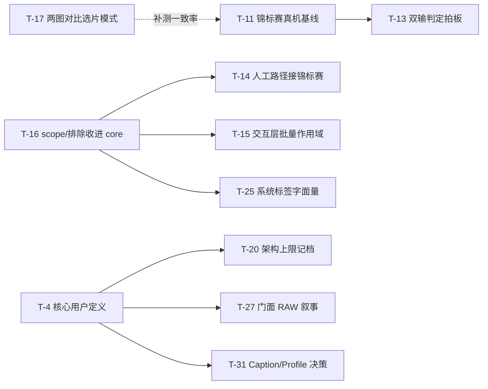

# PZT 三视角评审提案（2026-07-25）

## 1. 概览

**审视目标**：整个 PZT 项目（未指定模块或主题）。当前没有活跃周目标，因此本次评审同时承担"下一步押哪注"的决策输入。

**日期**：2026-07-25

**方法**：三个视角（Product Manager / User / Architect）拿同一份中立事实 brief 独立分析、互不通气，只在最后一步合并。合并时保留视角之间的张力（例如 PM 认为该把投入拉回人工选片路径，Architect 认为该先补跨进程契约测试），不做调和式平均。

**本次运行是只读的**：除本文档外未修改任何代码、配置或文档。

### 计数

| 维度 | 分布 |
|---|---|
| 原始 findings | PM 9 条 / User 13 条 / Architect 11 条，合计 33 条 |
| 合并后提案条目 | 32 条（3 组跨视角收敛，1 条 PM finding 拆成 2 条） |
| 按优先级 | P0 = 2，P1 = 15，P2 = 13，P3 = 2 |
| 按视角归属（收敛条目重复计） | PM 12 条 / User 14 条 / Architect 12 条 |
| 多视角收敛条目 | 5 条：T-2、T-8、T-11、T-13、T-22、T-27 |

### 三视角各自的一句话判断

- **PM**：产品**没有漂移**，thesis 说得出一句话（选片成本 = 单次决策延迟 × 决策次数，先把延迟压到零，再让 AI 替你减少决策次数）；真正的问题是**倾斜**——最近 10 天约 2/3 的工程投入落在 agent 对话层，同期人工选片路径一条新能力都没加、反而净丢了 AI 信号。
- **User**：主路径打磨得非常细，但**进入这条路的每一个入口都是漏的**（`--help` 报错、README 按键表是错的、RAW 在用户可见文档里为零、快速上手第三行开箱即失败），且**所有长任务都是黑箱**。
- **Architect**：分层契约兑现率相当高（`std::jthread`、`core` 零终端依赖、agent 纯子进程边界、eval 解耦无死引用，逐条核对属实）；债集中在**两条缝**——`cli/commands` 那 2900 行既承载业务逻辑又零测试覆盖，以及"headless 一次原子调用、不流式"这条契约在 AI 锦标赛把单次调用推到分钟级之后开始吞掉进度与取消能力。

> 编排者按：本次合并前对 13 项关键证据做了独立复核（`SPEC.md:88` 的 Stage 列表、`pick_keep_id` 是否还依赖评估、导出进度是否只对 RAW 触发、`stage_progress` 是否只被写 `None`、`run_bracket` 的整簇解码、schema 的 DROP 启发式与 `user_version`/WAL 缺失、`curate` 的 `random_device`、`f`/`g` 按键集合、`pzt --help` 退出码、LICENSE 是否存在等），全部与视角报告一致，无需修正。

---

## 2. 各视角 findings

### 2.1 Product Manager 视角

**PM-1 最近 10 天约 2/3 的工程投入落在 agent 对话层，与 SPEC 自己写的前提相悖**（`direction-drift`）

`docs/SPEC.md:19` 把长期愿景的前提写死："本地核心引擎的选片逻辑、数据结构、色彩流水线必须先被人工使用验证过、调校过，否则自动化只是在不稳固的地基上搭黑盒。这条原则决定了里程碑的推进顺序。"

实际轨迹背离这句话。`git log --since=2026-07-15` 分层统计：agent 69 个 commit、`+9452/-3426`；core 28 个 commit、`+3771/-1434`；cli 24 个 commit、`+1066/-370`。agent 内部结构更能说明问题：非测试 Python 代码里，对话与运行时（`agent/session/` + `agent/compose/` + `agent/transport/` + `agent/router/`）共 3129 行，真正干照片活的部分（`agent/stages/` + `agent/orchestrator/` + `agent/store/` + `pzt_client.py`）只有 850 行；六个 Stage 加起来 338 行，而单个 `agent/session/consumer.py` 就有 1227 行。绝大部分投入不是"让选片更好"，是"让一个 Telegram 会话不出错"。同期 `cli/commands/browse.cpp` 只收到 fix-it 与文案级改动，无一条新的选片能力。

**PM-2 W2026-07-21 的核心成果只接到了 agent，人工路径同时丢了旧信号又拿不到新能力**（`missing-feature`）

`core/tournament/cluster_and_choose`（`core/tournament/tournament.h:64`）是本周期最重要的新能力，但 cli 侧唯一入口是 headless 的 `cmd_dedup`/`cmd_curate`（`cli/commands/commands.cpp:151`、`:464`，`--ai --provider` 只在这里解析）。`pzt open` 的控制台命令表（`cli/commands/browse.cpp:411-453`）只有 `/help` `/dedup` `/tasks` `/filter` `/ai_eval`：`/dedup` 走 `handle_dedup_command`（`browse.cpp:257`）从不传 `ai_enabled`；`/curate` 根本不存在。同一周期还从人工路径拿走了东西（`W2026-07-21_PRD.md:37` 移除 `overall_score`/`passes_gate` 及下游）。人工路径净负：旧信号被删，替代品只装在机器人身上。这直接削弱 PM-1 引的那条 SPEC 前提——作者本人无法在 `pzt open` 里用上锦标赛，也就无从"用人工使用验证"它。

**PM-3 `/dedup` 仍在用一个已经失效的"未评估"确认闸门**（`ux-friction`）

`cli/commands/browse.cpp:270-282` 跑去重前统计未评估张数并弹 y/N；文案（`cli/i18n/i18n.cpp:1124-1130`）称"保留判断会退化成按拍摄时间选"。但 `core/dedup/dedup.cpp:104-120` 的 `pick_keep_id` 现在无条件"留 `captured_at` 最新"，代码注释原文就是"不再依赖选片评估分数"。不管评没评估，保留判断都按拍摄时间选。这个闸门现在传达错误信息，并且每次去重都多按一次键。属于"改了底层没扫干净上层"。

**PM-4 "核心用户是谁"被标为待拍板后 12 天无人回答，产品却已公开分发**（`open-design-question`）

`docs/history/M4_Brainstorm.md:190` 原文："**主要用户是谁**——是'个人发朋友圈'，还是也含'摄影师给客户交付初筛'？决定哪些用例是核心、策展/交付形态怎么设计。" 此后对活跃文档 + 两周 PRD grep 相关词，唯一命中是 `docs/history/W2026-07-15_PRD.md:25`，而那句话是再次延后。同时产品已越过"个人工具"边界：公开 Homebrew tap、三个已发布版本（v2026.7.20 / v2026.7.21 / v2026.7.24）、公开主页。后果不抽象：PM-6 的定位问题、Caption 去留、agent 要不要多用户，三件事都卡在这个未答问题上。

**PM-5 已公开分发三个版本，但仓库没有 LICENSE**（`architecture-debt`）

仓库根目录无 LICENSE（已复核确认）。`README.md:99-101` 自认"发布正式版前需补上"，`packaging/homebrew/pzt.rb:6` 同样记录。但"发布正式版前"这句已被现实推翻：三个版本已通过公开 tap 发出，formula 的 `url` 直指 GitHub release tarball。无 License 在法律上等于保留所有权利。

**PM-6 公开门面完全没讲产品真正的差异点：RAW 旁路选片**（`direction-drift`）

`docs/SPEC.md:17` 把差异点写得很明确（culling 只读相机 ISP 内嵌 JPEG、绕过 RAW 解码、按需升级复杂度），`SPEC.md:15` 更把"想用 RAW 却因为麻烦而放弃"点名为立项动机。但对 `README.md` 与 `website/index.html` grep RAW 相关词，全部命中都是 brew 依赖清单里的 `libraw` 包名（复核确认：README 2 行、index.html 1 行）。"RAW"作为产品能力在两个公开面里从未出现。同时"零延迟选片"被降格解释成通用实现细节（"配合预取缓存做到按键即出图"），任何图片查看器都能这么写；`index.html:104-123` 的四张 feature card 里 Telegram agent 占 1/4 版面，恰是最没有壁垒的那块。

**PM-7 M4 的招牌用例只交付 2/3，缺的那块连同 Profile 一起无声消失**（`missing-feature`）

`docs/history/M4_Agent_Workflow_Design.md:34` 定义的初始 Stage 库是七个，含 `Caption`（`:73` 还定了默认闸门策略）；`M4_PRD.md:118` 把"`Style` + `Caption`"列为完整朋友圈形态。今天 `agent/stages/` 只有六个文件，无 `caption.py`；对 SPEC、Task_Pool、README、agent/README、主页 grep "文案|Caption" 零命中。它既没被做，也没进"未来/搁置"清单，也没进 Task_Pool。同类的还有 Profile（`agent/compose/plan_composer.py:48` 留着 `del profile, last_config  # 子增量 E 未实现`）。连带一处 ground truth 失准：`docs/SPEC.md:88` 仍写着 Stage 库含 `Evaluate`，而 commit `8c8283b` 已删掉它（复核确认）。

**PM-8 Next bet 一：把"比较优于打分"还给人，`pzt open` 两图对比选片模式**（`next-bet`）

`W2026-07-21_PRD.md:14` 写清动机："一张照片单独送进模型打出来的分，本质是在各自独立的会话里生成的，跨图直接比大小并不可靠"；`:19` 给出结论：涉及比较的选择走锦标赛，而不是各自赋分再横向比。这个洞察对人同样成立、甚至更成立，但人的选片循环至今仍是 `h`/`l` 一次一张（`cli/commands/browse.cpp:1225-1229`），恰恰就是这份 PRD 刚宣布无效的单张评价模型。技术上不是新能力：Kitty 按 image id 传输，一屏画两张不是新机制；`core::dedup::find_duplicates` 已能产出簇结构；`core/tournament` 的 bracket 推进（`tournament.cpp:76-165`）已是现成的确定性算法，只需把 `CompareFn` 从"调模型"换成"等一次按键"。它是唯一一条同时压低"每次决策延迟"和"决策总次数"的路径，直击 `SPEC.md:15` 的原始痛点；Task_Pool 现有条目全是摩擦修补，没有一条能改变选片这件事的量级。

**PM-9 Next bet 二：agent 层现在不该拓宽，先给锦标赛量一个质量与成本基线**（`next-bet`）

锦标赛是目前 agent 端选片质量的全部来源，却至今没有任何质量或成本数字。`W2026-07-21_Tournament_Eng_Design.md:148` 把进度播报推给"真机跑出实际延迟数据后再决定"，`:155` 的验收标准原文是"真机粗测一次即可，不需要精确基准"；`W2026-07-21_PRD.md:136` 把 pairwise 单次延迟与整簇总耗时列为待细化项，从未收口。同时 `Task_Pool.md:35` 记录了已知语义缺口（双输判定）。拓宽（多用户、bottle、公网托管）会把这个未测基线复制给更多人，且 `agent/README.md:68-72` 明确写着当前运行时假设不支持多用户。

---

### 2.2 User 视角

场景设定：S1 首次使用者（800 张旅行 JPEG）、S2 周更老手（第 100 次选片）、S3 RAW 摄影师、S4 路上的 Telegram 用户、S5 非核心/误装用户。

**U-1 筛选键实际是 `f`，README 与内置 usage 全写 `g`，按 `g` 完全静默**（`ux-friction`，S1）

README.md:51 写 `| g | 按标签筛选视图 |`，`usage_main()`（`cli/i18n/i18n.cpp:82-95`）写 `"g 筛选"`。代码里筛选入口早已改成 `f`（`cli/commands/browse.cpp:1293-1303`，`cli/menu/filter_menu.cpp:19-23` 注释记录了这次改名）。更糟的是 `g` 根本不在主循环接受的按键集合里（`browse.cpp:1198-1199`，只认 `q/h/l/j/k/space/x/f/r/e/:`），不认识的字节在内层 `while` 里被直接吃掉、不重绘、不提示。用户按 `g` 得到零反馈，无法区分"卡住"和"按错"。**编排者已独立复核，属实。** 子菜单层已有"无效按键给提示"的约定（`filter_menu.cpp:46-48`），只有顶层没有。

**U-2 `pzt --help` 报"未知子命令"并 exit 1；`:` 控制台整套能力在 usage 里不存在**（`ux-friction`，S1/S5）

实测 `pzt --help` 输出 `pzt: 未知子命令 '--help'` + usage，**退出码 1**（编排者已复核）。`cli/main.cpp:25-27` 只特判 `--version`/`version`。同时 `usage_main()` 完全没提 `:` 控制台，而 `/dedup`（近似重复检测的唯一交互入口）、`/ai_eval`、`/filter`、`/tasks` 全挂在这里，只看 usage 的人永远不知道去重功能存在。另外 `msg_tag_list_empty`（`i18n.cpp:344-350`）叫用户"用 pzt tag create 创建一个"，但 `cmd_tag` 只 dispatch `list/apply/clear`（`commands.cpp:1162-1168`），指向一个不存在的命令。

**U-3 RAW 摄影师是死路：纯 RAW 目录建项目直接失败，错误文案还谎称"没有 RAW 文件"**（`missing-feature`，S3）

`support_raw=false` 时 `scan_media` 的 RAW 分支整个不进（`core/project/project.cpp:129`），`jpegs` 为空导致 `NoImagesFound`（`:245-247`），打印"'<path>' 目录下没有找到任何 JPEG/RAW 文件"（`i18n.cpp:176-182`）。这句话在一个塞满 RAW 的目录上是**事实错误**，而且主动排除了"是不是我没开 RAW"这个正确猜想。`--support-raw` 是**刻意隐藏**的：`commands.cpp:744-746` 注释原文"`--support-raw` 不出现在 `usage_main()` 里"；`pzt rescan` 的 usage 也只写了 `[--no-prune]`。混合目录还有救（`rescan --support-raw` 能升级 JPEG 记录，`project.cpp:723-726`），纯 RAW 目录连项目都建不出来，无任何 workaround。

**U-4 没有"导出所有非废片"的路径，README 快速上手第三行开箱即失败**（`missing-feature`，S1）

照 `README.md:37-40` 走：`pzt new` 只建了"废片"系统标签（`commands.cpp:798`），"精选"不存在，`cmd_export` 直接 `err_export_tag_not_found` 退出（`commands.cpp:1114-1118`）。更根本的是"标掉坏的、导出剩下的"这个最自然的流程根本没有出口：`cmd_export` 强制要标签名；应用内 `e` 在无筛选时只导出当前这张（`browse.cpp:1384-1386`）；`/filter` 的四个条件是 `unevaluated/fail/reject/dup`（`browse.cpp:340`），全是正向选择、没有取反；`f` 菜单只能按标签正选。800 张里留 200 张，用户要按 400 次额外按键。

**U-5 批量导出纯 JPEG 全程零进度，界面冻结，结束后还把期间按的键全丢掉**（`missing-feedback`，S1/S2）

进度回调**只对 RAW 触发**：`core/export/export.cpp:148-152` 用 `raw_total` 当分母，`:183-186` 只在 `img.kind == "raw"` 时调 `on_progress`，注释自己写着"纯 JPEG 批次 `raw_total==0`，`on_progress` 全程不会被调用"（编排者已复核）。导 300 张 JPEG 在终端上完全静默；应用内 `e`→`f` 同样。此时还在 AltScreen 里、banner 停在上一帧，看起来就是死机。导出返回后立刻 `flush_pending_input()`（`browse.cpp:147`），用户以为卡住而按的键被全部丢弃。（与 Task Pool F-47 不同，F-47 只讲导入。）

**U-6 `/dedup` 把整个 TUI 冻死几秒到几十秒，且是显式传 `nullptr` 放弃进度的**（`missing-feedback`，S2）

`browse.cpp:283-285` 显式传 `/*on_progress=*/nullptr`；`:250-256` 注释坦承"这段时间 `pzt open` 冻结、不接受任何输入……不传 `on_progress` 是因为这段时间主循环没有机会重绘，传了也没地方画"。这是循环论证：正是因为没异步化才没地方画。用户视角是终端彻底死掉几十秒，没有存活信号也没有取消办法（`Ctrl-C` 会丢掉 `set_last_image_id` 续点，`browse.cpp:1453` 只在干净退出时写）。对比之下 agent 侧的同一能力是可取消的（`worker.py:9-13`）。

**U-7 CLI 里风格只能一张一张套，agent 有 `StyleApplyAll`，真人用户没有**（`missing-feature`，S2）

`r` 键的每条路径最终都是 `set_image_recipe(image_id, ...)` 单张（`cli/menu/recipe_menu.cpp:315`、`:282`），`handle_r_key` 签名只接受一个 `image_id`（`:261`）。给 30 张精选套同一预设 = 90 次按键 + 30 次导航。而 agent 侧对同一件事有专门的批量 Stage（`agent/stages/style_apply_all.py:33-38`）。headless 编排层拿到了交互层没有的能力，方向正好反了。

**U-8 自建 version 是 9 个连续的盲填数字问答，无实时预览，填错静默变 0**（`ux-friction`，S2）

`recipe_menu.cpp:168-193` 要求连续回答 9 个文本输入，中途任何一步 Esc 丢弃前面全部输入。整个过程中屏幕上的图片一动不动，要填完 9 项、创建、再走一遍 `r`→预设→version 才第一次看到效果。不满意就重来，且每个预设下最多 9 个 version（`:152-154`）。解析失败/超范围一律静默变 0（`:156-166`），输入 `50%`（与提示语 `-100~100%` 的写法一致）会被解析成 0，用户完全看不出发生了什么。

**U-9 标签超过 8 个之后，第 9 个起在应用内彻底无法使用，且没有任何提示**（`ux-friction`，S2）

`tags_for_menu` 无条件 `if (tags.size() > 8) tags.resize(8);`（`cli/menu/tag_menu.cpp:175`，编排者已复核），截断后不给任何提示。第 9 个标签在 `space` 打标签菜单、`space -` 摘除菜单、`f` 筛选菜单里全部不存在，但 `pzt tag list` 还能看到它、`pzt export` 还能用它导出。这不是"数字键只有 10 个"的物理限制：`9` 被硬编码给了"重复"系统标签（`:167-168`），而"重复"只在跑过 `/dedup` 后才出现，多数会话里那个键位是空的。

**U-10 Telegram 处理期间是彻底的黑箱，`stage_progress` 是个从未被写入的死字段**（`missing-feedback`，S4）

确认方案后用户收到"正在筛选..."（`agent/session/view.py:23-28`），然后沉默；而 AI 锦标赛按项目自己的说法"可能跑到分钟级"（`agent/session/worker.py:11`）。期间：(a) 周期性进度播报只在 `COLLECTING` 生效（`consumer.py:1018-1021`）；(b) idle 提醒同样跳过 `RUNNING`（`consumer.py:994-1014`）；(c) `SessionView.stage_progress` 在现役代码里**只被赋值为 `None`**（`consumer.py:541`、`:867`，编排者已复核），`view.py:74-76` 依赖它的分支因此是死代码。对照 `agent/build/lib/session/consumer.py:953-954` 可见旧版本确实有过"已完成 X/Y 张"，在 eval 解耦时被一起删掉、没补回来。`agent/README.md:66` 还在把 `--progress-interval-seconds` 宣传成"进度播报节奏"，实际只管收图阶段。

**U-11 三种"环境不对"的失败都不告知原因**（`missing-feedback`，S5）

(a) **终端**：`detect_terminal_mode()` 只检查 tmux 的 `allow-passthrough`（`cli/kitty/kitty.cpp:93-108`），**完全没有探测终端是否支持 Kitty 图像协议**。在 iTerm2/Terminal.app/Alacritty 里跑 `pzt open`，`write()` 成功、不打任何错误，用户看到一个画好边框和信息栏、图片区永远空白的界面。产品的核心卖点静默失效，且没有一个字告诉他要装 Ghostty。(b) **token**：`run_telegram.py:133-134` 的 `token_from_env()` 在任何 try 之外，缺环境变量时抛裸 traceback。(c) **模型**：启动时没有 Ollama 可达性预检，用户要发完照片、打完意图才在 `_on_compose_failed`（`consumer.py:857-863`）收到"AI 服务好像连不上"，且不告诉他去 `ollama serve`。

**U-12 批量 AI 评估的失败只报"图 47"这种裸数据库 ID，而且一次只保留最后一条**（`missing-feedback`，S2/S5）

`i18n.cpp:993-999` 直接 `std::to_string(image_id)`，用户手上只有文件名，无法映射；界面其它地方都是用 `file_name` 展示的（`browse.cpp:873`）。`take_last_failure()` 只保留最近一次失败（`browse.cpp:1172-1175`），800 张全失败时用户只得到零星几条无法定位的提示，既没有失败总数也没有"值得停下来检查环境"的信号。`/tasks` 只报排队/处理中数量。

**U-13 建议砍掉：`pzt archive` / `pzt unarchive`**（`redundant-surface`）

归档只写 `archived_at` 一列（`core/project/project.cpp:382`）。它**不隐藏** `pzt list`（`commands.cpp:821-832` 无条件打印全部，只在行尾加 `[已归档]`），**不阻止** `pzt open`/`rescan`/`export`（`cmd_open` 从没读过 `archived`）。唯一实际行为是 `list_projects` 的 `ORDER BY (p.archived_at IS NULL) DESC`（`:338`）把归档项目排到后面。面向人的 11 个子命令里有 2 个是一个排序键的开关，而 `unarchive` 还是最近才专门补上的（commit `cc3e7b6`）。当前状态是最糟的一种：占着 usage 篇幅，却不做用户以为它做的事。

---

### 2.3 Architect 视角

先记正面判断，避免把功劳埋在问题清单里：**`std::jthread` 契约 100% 兑现**（生产代码里 `std::thread` 只命中 `core/export/export.cpp:96,107` 的 `hardware_concurrency()` 静态函数）；**`core` 零终端依赖**（`termios/ioctl/ncurses/isatty/STDOUT_FILENO/std::cout` 在 `core/` 生产代码零命中）；**`agent` 确实只经 `agent/pzt_client.py` 的 subprocess 触碰 `pzt`**；**W2026-07-21 eval 解耦没留死引用**（`overall_score`/`passes_gate` 全仓仅剩 3 处解释性注释）。这些是真做到了，不是自我宣称。

**A-1 `cli/commands` 承载了成规模的业务逻辑，且同一套规则在三层各实现一份**（`module-coupling`）

SPEC §4.1 写死"`cli` 只调用 `core` 接口、不承载业务逻辑"，实际不成立：`browse.cpp:205-232` 的 `resolve_console_scope` 是一个完整的范围查询 DSL 解析器；`:239-246` 的 `exclude_scope_by_tag` 实现 F-26 的对称例外策略；`:374-403` 的 `apply_console_filter` 直接做筛选计算并逐张 `get_image()`（自注释承认 N+1）；`cmd_open` 本身是 950 行单函数。更关键的是**同一条业务规则被实现了三次**：排除规则在 `core/tournament/tournament.cpp:89-100`、`cli/commands/browse.cpp:239`、`agent/stages/curate.py:36` 各一份；scope 解析在 `browse.cpp:205` 与 `commands.cpp:110` 各一份（`commands.cpp:96-102` 注释明确承认是有意重写）。一个具体后果已经发生：headless 的 `cmd_dedup`/`cmd_eval` **不做**废片排除，交互的 `/dedup` **做**排除——同名操作在两个入口语义不同。（`Slim_Plan_2026-07-24.md` 的 F-2/F-3 从可读性角度记过其中两点并判"不动"，但没归到分层契约违反，也没覆盖 `exclude_scope_by_tag`/`apply_console_filter` 这类真正的策略逻辑。）

**A-2 agent↔core 的 JSON 契约两侧都没有测试**（`architecture-debt`）

`cli/tests/CMakeLists.txt` 只编 `i18n_test.cpp`/`kitty_test.cpp`/`text_test.cpp`。`commands.cpp`（1446 行，**headless 命令面的全部实现**）与 `browse.cpp`（1480 行）零覆盖。agent 一侧所有 stage 测试都手写 JSON 字符串喂 fake runner（`agent/tests/stages/test_curate.py:130`、`test_dedup.py:35`）。唯一碰真二进制的测试（`test_pzt_client.py:76-85`）显式只验证接线、不验证 schema。`cmd_curate` 输出的 `selected`（`commands.cpp:552-555`）与 `agent/stages/curate.py:51` 读的 `result["selected"]` 之间没有任何自动化检查在守。SPEC §4.4 要求核心逻辑有单测，`core` 侧做得很好（21 个测试文件、297 个 case），但**跨进程契约这条最容易漂移的缝恰好落在两侧覆盖的空档里**。

**A-3 `pzt eval` / `pzt compare` 已成无消费者的孤儿命令，三处文档漂移**（`redundant-surface`）

`plan_composer.py:3` 与 `run_watchfolder.py:6` 都写着"Evaluate stage 已删除"；`run_telegram.py:80-89` 注册的 stage 只有 6 个；全仓 grep `client.call("eval"` 在生产代码零命中（编排者已复核）。因此 `cmd_eval`（`commands.cpp:326-452`）没有任何调用方——交互路径走的是 `EvaluationWorker` 而不是这个子命令。`pzt compare` 同样：`tournament.cpp:174` 直接进程内调 `ai::request_comparison`，`cmd_compare`（`commands.cpp:588-648`）零消费者。文档同步失效三处：`docs/SPEC.md:88` 仍列 `Evaluate` Stage（已复核）；`README.md:65` 写"`pzt dedup` / `pzt curate` 内部调用 `pzt compare`"（事实错误）；`core/ai/compare.h:13` 注释仍写"bracket 编排在 agent"（`tournament.h:22` 已改成收进 core）。

**A-4 锦标赛"禁止平局"依赖的上游 `unusable` 过滤在 agent 管线里根本不存在**（`open-design-question`）

`core/ai/compare.h:24-28` 明确写"必须二选一(禁止平局)"，`W2026-07-21_Eval_Eng_Design.md:192` 给出前提："对焦这类可用性问题由 eval 的 `unusable` 在上游过滤，pairwise 假定两张都可用"。但目标三删掉了 `Evaluate` Stage，`plan_composer.py:61-89` 组装的 Plan 里没有任何一步跑 eval；`tournament.cpp:87-100` 的排除集只按标签名排（`{"废片"}` / `{"废片","重复"}`），而"废片"标签只在 `auto_ai_reject=true`（默认 `false`，`core/settings/settings.h:48`）且用户先手动跑过评估时才会被自动打上。**结论：agent 走 AI 锦标赛时，`unusable` 过滤这一环是空的**，pairwise 在被明确告知"假定两张都可用"的前提下，实际会拿两张糊片强行二选一。`Task_Pool.md:35` 的"双输判定"当时是作为可选增强挂账的，其触发前提现在已经成立——它不再是增强，是补一个被 Stage 删除动作打穿的假设。

**A-5 schema 迁移故事建立在"没有真实用户"的前提上，而 Homebrew 分发已让这个前提失效**（`architecture-debt`）

全仓没有 `PRAGMA user_version`（编排者已复核，零命中）。迁移全靠 `core/db/schema.cpp:163-229`：9 次幂等 `ensure_column`（这部分是对的）+ **一次启发式破坏性迁移**（`:179-182`）：检测到 `exposure_score` 或 `unusable` 列存在就 `DROP TABLE image_evaluations;`。其依据写在 `:174-178`："库里都是迭代测试数据，无真实用户数据要保留，直接作废重设不写迁移(PRD 已拍板)"。这个前提在 Homebrew tap 分发上线之后不成立了：任何在两个 release 之间装过并跑过评估的用户，`brew upgrade` 后评估结果会被静默 DROP，无提示无备份。`docs/RELEASE.md` 与 `README.md` 无任何迁移/数据兼容性说明。次生风险（推断，未验证）：没有版本号意味着降级路径也不设防；且这次的 DROP 启发式按列名匹配，未来若再出现同名列会误触发。

**A-6 `run_bracket` 一次性解码整簇，把 F-13 的触发条件实质推近了一大截**（`architecture-debt`）

`core/tournament/tournament.cpp:46-52` 在第一轮开始前把整簇成员全部解码成全分辨率 RGBA 并同时驻留（编排者已复核）。对照 `core/dedup/dedup.cpp:220-241`：它逐张解码算 dHash，`decoded` 每轮迭代即析构，峰值只有一张。**AI 锦标赛引入了一个此前不存在的 N 倍峰值内存**，而 `Task_Pool.md:30` 里 F-13 的实测基线（2026-07-19）是在这次改造之前测的，那份"24MP×7≈0.7GB"对应的是预取缓存、不覆盖这条新路径。量级（推断）：`curate_time_window_seconds=20` / `curate_hash_threshold=10` 是刻意放宽到"同一场景"粒度的（`settings.h:29-35`），curate 的簇天然比 dedup 大；一个 15 张场景簇约 1.5GB 瞬时驻留，60MP 素材数倍。同一批图还会被解码两次（`tournament.cpp:15-19` 注释已承认）。

**A-7 headless 的原子契约让长 AI 运行结构性地不可观测，取消覆盖面也有洞**（`tech-choice`）

SPEC §3.2 把"一次提交、一次收尾的原子调用，不做流式输出"写成硬契约。这在 M4 是对的（stage 都是秒级），但目标二把锦标赛收进 core 之后，一次 `pzt dedup --ai` 内部要跑 Σ(簇大小 - 1) 次视觉推理，每次受 `core/ai/ai.cpp:335` 的 `CURLOPT_TIMEOUT 60L` 约束，量级跳到分钟级。三个后果都有代码证据：(1) **进度完全丢失**——`DedupProgressFn` 一路铺到 `cluster_and_choose`（`tournament.h:60-63` 特意注明"不能悄悄把它吞掉"），但 `commands.cpp:199` 传的是 `nullptr`，因为 stdout 被单个 JSON 对象占死；agent 侧对应地 `protocol.py:85-87` 明写"注意没有 StageProgress 事件"。(2) **`ai_fallback_count` 这个唯一的降级信号在 Curate 路径上被丢弃**——`commands.cpp:556` 发出它，`agent/stages/dedup.py:27` 原样带过，但 `agent/stages/curate.py:60-64` 重建了一个只含 `requested`/`returned`/`selected` 的 dict，字段就此蒸发（编排者已复核：`ai_fallback_count` 在 agent 侧零命中）。整簇因超时退化成"按拍摄时间选"时，用户拿到的话术和 AI 真跑通时完全一样。(3) **取消只覆盖一半**——`worker.py:47` 的 `KILLABLE_STAGES = ("Dedup", "Curate")`，而 `Style`（内部走 `recipe suggest`）与 `StyleApplyAll`（循环 N 次子进程）都不可杀。

**A-8 系统标签的中文字面量泄漏进 Python 层，成为第三份排除规则实现**（`module-coupling`）

`core/tagging/tagging.h:123,137` 把 `kRejectTagName = "废片"` / `kDuplicateTagName = "重复"` 定义为 core 常量，`cli/i18n/i18n.cpp:67` 正确地只做展示层映射。但 `agent/stages/curate.py:36` 直接硬编码中文字面量做过滤（编排者已复核），这条 passthrough 路径绕过 `pzt curate`，在 Python 里复刻了一遍 `tournament.cpp:87-100` 的排除语义。耦合面：core 改字面量或未来 i18n 化系统标签名，agent 会静默地不过滤任何东西（不报错，只是结果变错）。`cmd_images` 输出的 `tags` 是原始标签名数组（`commands.cpp:686-688`），确实没给 agent 任何机读标记。

**A-9 门面"每次调用开一次库并跑全量 schema init"在 headless 的 O(N) 循环里被放大**（`architecture-debt`，与已归档的 F-38 不是同一条）

`core/api.cpp` 里 60 余个门面函数每个都以 `Database::open_default()` 开头，而 `open_at`（`core/db/database.cpp:43`）无条件调 `initialize_schema`，后者每次跑 7 条 `CREATE TABLE IF NOT EXISTS` + 2 条 `CREATE INDEX` + 11 次 `PRAGMA table_info` 全表扫。`Task_Pool.md:32` 的 F-38 已实测过（~184µs/次，导航帧 ~0.9ms、占 60ms 预算 1.5%，判"可忽略"）——**这个判断在交互路径上依然成立，不需要重开**。但 F-38 的口径是"每帧"，没覆盖 headless 的**每图**放大：`cmd_images`（`commands.cpp:677-690`）对每张图调 `get_image()` + `tags_for_image()` 各开一次库（300 张 ≈ 600 次 open + 600 次全量 schema init）；`agent/stages/curate.py:56` 与 `style_apply_all.py:35` 是**每张图起一个 `pzt` 进程**（实测本机纯进程启动 4.4ms/次），每个 `tag apply` 内部还要开 4 次库。今天量级（选 9-12 张）在百毫秒级不是问题，问题是**这个形状随批量线性劣化，而产品方向明确指向更大批量**。

**A-10 单会话 / 单库 / 全局唯一项目名的假设与"多用户 agent 托管"方向正面冲突**（`tech-choice`）

三个层面锁死单用户：(1) **会话层**——`SessionConsumer.__init__`（`consumer.py:100-102`）接单个 `chat_id`，实例上只有一个 `self.run`；`run_telegram.py` 顶部注释写"同一个 bot 同时只能跑一个入口（Telegram getUpdates 单消费者，双开会 409 Conflict）"。(2) **数据层**——单个全局 `~/.config/pzt/pzt.db`，且 `projects.name` 是 `TEXT NOT NULL UNIQUE`（`schema.cpp:22`），项目名是全局命名空间。(3) **并发层**——连接只设了 `sqlite3_busy_timeout(db, 5000)`（`database.cpp:41`），**没有开 WAL**（编排者已复核，`journal_mode` 全仓零命中）。默认 rollback journal 下写者阻塞读者，而当前已存在多写者：`EvaluationWorker` 后台线程一条连接 + 主线程 + agent 派生的 `pzt` 子进程。今天靠 5 秒忙等兜住，并发用户数上去之后这是第一个塌的地方。

**A-11 `curate --ai` 用真随机采样，与 agent"只作废并重跑受影响子图"的重跑模型语义冲突**（`open-design-question`）

`core/curate/curate.cpp:119-124` 用 `std::mt19937 rng(std::random_device{}())` 从 winner 集合采样（编排者已复核）。注释说明这是 PRD 拍板"接受不可复现"，理由是"没有质量分可比"。该理由在单次运行语境下站得住，但与 SPEC §3.3 的人在环模型相撞："用户的对话调整……只作废并重跑受影响的子图"。`agent/orchestrator/driver.py:126-137` 的 `apply_adjustment` 会把下游 stage 重置成 PENDING 并重跑——用户在闸门上说"换一张"或调完 `count` 之后，`Curate` 重跑会得到一组**全新的随机结果**，而不是"在上次结果基础上换掉那一张"。`agent/stages/curate.py:37,51` 的 `exclude` 机制正是为"换掉某几张"设计的，但它是在一个每次都重掷骰子的候选集上做排除。注意 `random_device` 每次都重播种，连"同一 run 内可复现"都做不到。判断：原 PRD 拍板"接受不可复现"很可能没考虑重跑场景，因为那次拍板早于 exclude 换图机制。

---

## 3. 提案条目

按优先级排序，同优先级内按复杂度升序。"视角"列列出所有原始来源，多视角收敛是置信度信号。

| ID | 标题 | 视角 | 类型 | 优先级 | 复杂度 | 范围（文件/区域） | AI 工期 | 依赖 |
|---|---|---|---|---|---|---|---|---|
| T-1 | ~~选片闭环没有"导出留下的这些"出口，README 快速上手第三行开箱即失败~~（**已完成**，新增 `pzt export <project> --all-keep <folder>` 与 `pzt open` 里 `e` 键的"导出全部"选项，两者都复用 core 既有的 `export_images` F-26 排除规则，core 零改动；`e` 键二级菜单改为始终弹出） | User | `missing-feature` | P0 | M | `cli/commands/browse.cpp:340,1384-1408`、`cli/commands/commands.cpp:1106-1118`、`core/export`、`README.md:37-40` | ~2-3h (AI) | none |
| T-2 | ~~纯 RAW 目录建项目直接失败，错误信息事实错误，`--support-raw` 全线不可发现~~（**已完成**，错误信息已按场景区分并提示 `--support-raw`；`--support-raw` 不进 `pzt --help` 仍是 `docs/RAW_Support.md` 记录的既有设计，未改动） | User, PM | `missing-feature` | P0 | S | `core/project/project.cpp:129,245-247`、`cli/i18n/i18n.cpp:176-182`、`cli/commands/commands.cpp:744-746` | ~1h (AI) | none |
| T-3 | 筛选键实际是 `f`，README 与内置 usage 都写 `g`；顶层未知按键完全静默 | User | `ux-friction` | P1 | XS | `README.md:51`、`cli/i18n/i18n.cpp:82-95`、`cli/commands/browse.cpp:1198-1199` | ~20min (AI) | none |
| T-4 | "核心用户是谁"12 天前标为待拍板至今未答，而产品已公开分发三个版本 | PM | `open-design-question` | P1 | XS | `docs/SPEC.md` 第一节、`docs/history/M4_Brainstorm.md:190` | ~30min (AI 起草，需用户拍板) | none |
| T-5 | 下一周期投入配比：至少一半 deliverable 落回 `pzt open` / `core` 人工选片路径 | PM | `direction-drift` | P1 | XS | 规划决策，写进下一周目标文档 | ~30min (AI) | none |
| T-6 | 纯 JPEG 批量导出全程零进度，结束后还丢弃期间按键 | User | `missing-feedback` | P1 | S | `core/export/export.cpp:145-152,180-186`、`cli/commands/browse.cpp:136-147` | ~1h (AI) | none |
| T-7 | schema 无版本闸门，一条破坏性 `DROP TABLE` 已随 Homebrew 分发出去；且未开 WAL | Architect | `architecture-debt` | P1 | M | `core/db/schema.cpp:172-184`、`core/db/database.cpp:41-43`、`docs/RELEASE.md` | ~2h (AI) | none |
| T-8 | headless 长运行结构性不可观测：Telegram 分钟级 AI 运行是纯黑箱，降级信号丢失，取消只覆盖一半 | User, Architect | `missing-feedback` | P1 | M | `cli/commands/commands.cpp:199`、`agent/pzt_client.py:53-54`、`agent/session/consumer.py:541,867`、`agent/session/view.py:74-76`、`agent/stages/curate.py:60-64`、`agent/session/worker.py:47` | ~half day (AI) | none |
| T-9 | `/dedup` 冻死整个 TUI 几秒到几十秒，且显式传 `nullptr` 放弃进度 | User | `missing-feedback` | P1 | M | `cli/commands/browse.cpp:250-256,283-290` | ~3h (AI) | none |
| T-10 | 三种环境失败都不告知原因：非 Ghostty 画空框、缺 token 抛 traceback、Ollama 未起要等到意图解析 | User | `missing-feedback` | P1 | M | `cli/kitty/kitty.cpp:93-108`、`cli/commands/browse.cpp:577-581`、`agent/run_telegram.py:133-134`、`agent/session/consumer.py:857-863` | ~3h (AI) | none |
| T-11 | 锦标赛至今没有任何质量/成本数字，却已是 agent 选片质量的全部来源 | PM, Architect | `next-bet` | P1 | M | 真机 3 批素材；`core/tournament`、`core/ai/ai.cpp:335` | ~half day (AI) + 真机跑批 | none（"人机一致率"一项需 T-17 落地后补测） |
| T-12 | agent↔core 的 JSON 契约两侧都没有测试，`cli/commands` 2900 行零覆盖 | Architect | `architecture-debt` | P1 | M | `cli/tests/CMakeLists.txt`、`cli/commands/commands.cpp`、`agent/tests/stages/*` | ~half day (AI) | none |
| T-13 | 锦标赛"禁止平局"依赖的上游 `unusable` 过滤在 agent 管线里根本不存在 | Architect, PM | `open-design-question` | P1 | M（设计）/ L（实现） | `core/ai/compare.h:24-28`、`core/tournament/tournament.cpp:87-100`、`agent/compose/plan_composer.py:61-89` | ~half day (AI，出 Eng Design) | T-11 |
| T-14 | 锦标赛能力只接了 agent：`/dedup` 不传 `ai_enabled`、`/curate` 根本不存在 | PM | `missing-feature` | P1 | M | `cli/commands/browse.cpp:257,411-453`、`cli/commands/commands.cpp:151,464` | ~half day (AI) | T-16 |
| T-15 | 交互层没有批量作用域：批量套风格只有 agent 有，真人要按 90 次键 | User | `missing-feature` | P1 | M | `cli/menu/recipe_menu.cpp:261-315`、`cli/commands/browse.cpp:1388-1408`；与 Task Pool F-44 共用一套选择模型 | ~half day (AI) | T-16 |
| T-16 | scope 解析与"排除废片"策略在 core/cli/agent 各一份，headless 与交互语义已经分叉 | Architect | `module-coupling` | P1 | L | `cli/commands/browse.cpp:205-246,374-403`、`cli/commands/commands.cpp:96-110`、`core/tournament/tournament.cpp:89-100`、`agent/stages/curate.py:36` | ~1-2 days (AI)，先出 PRD | none |
| T-17 | Next bet：把"比较优于打分"还给人，`pzt open` 两图对比选片模式 | PM | `next-bet` | P1 | L | `cli/commands/browse.cpp`、`cli/kitty/`、`core/tournament/tournament.cpp:76-165`、`core/dedup` | ~1-2 days (AI)，先出 PRD | none |
| T-18 | `pzt --help` 报未知子命令并 exit 1；`:` 控制台不在 usage；`pzt tag create` 被文案指向但不存在 | User | `ux-friction` | P2 | XS | `cli/main.cpp:25-27,60-62`、`cli/i18n/i18n.cpp:79-95,344-350` | ~30min (AI) | none |
| T-19 | ~~已公开分发三个版本，仓库无 LICENSE~~（**已完成**，MIT，commit `f2a6425`） | PM | `architecture-debt` | P2 | XS | 仓库根目录、`README.md:99-101`、`packaging/homebrew/pzt.rb:6` | ~20min (AI，许可证类型需用户选) | none |
| T-20 | 单会话/单库/全局唯一项目名是已知架构上限，应记档而非现在动手 | Architect | `tech-choice` | P2 | XS（记档）/ XL（真立项） | `agent/session/consumer.py:100-134`、`core/db/schema.cpp:22`、`docs/SPEC.md` | ~30min (AI) | T-4 |
| T-21 | `/dedup` 仍在用一个已经失效的"未评估"确认闸门吓唬用户 | PM | `ux-friction` | P2 | S | `cli/commands/browse.cpp:270-282`、`cli/i18n/i18n.cpp:1124-1130`、`core/dedup/dedup.cpp:104-120` | ~30min (AI) | none |
| T-22 | `pzt eval` / `pzt compare` 已成无消费者的孤儿命令，SPEC §3.3 / README:65 / `compare.h:13` 三处漂移 | Architect, PM | `redundant-surface` | P2 | S | `cli/commands/commands.cpp:326-452,588-648`、`docs/SPEC.md:88`、`README.md:65`、`core/ai/compare.h:13` | ~1h (AI) | none |
| T-23 | AI 评估失败只报裸数据库 ID，且一次只保留最后一条 | User | `missing-feedback` | P2 | S | `cli/i18n/i18n.cpp:993-999`、`cli/commands/browse.cpp:1172-1175` | ~1h (AI) | none |
| T-24 | 标签超过 8 个后第 9 个起在应用内彻底不可用，无任何提示 | User | `ux-friction` | P2 | S | `cli/menu/tag_menu.cpp:167-175`、`cli/menu/filter_menu.cpp:41-44` | ~1h (AI) | none |
| T-25 | 系统标签中文字面量泄漏进 Python，成为第三份排除规则实现 | Architect | `module-coupling` | P2 | S | `agent/stages/curate.py:36`、`cli/commands/commands.cpp:686-688`、`core/tagging/tagging.h:123,137` | ~1h (AI) | T-16 |
| T-26 | `curate --ai` 用 `random_device` 真随机，与"只作废并重跑受影响子图"的重跑模型冲突 | Architect | `open-design-question` | P2 | S | `core/curate/curate.cpp:119-124`、`agent/orchestrator/driver.py:126-137`、`agent/stages/curate.py:37,51` | ~1h (AI) | none |
| T-27 | 公开门面完全没讲产品真正的差异点：RAW 旁路选片 | PM, User | `direction-drift` | P2 | S | `README.md`、`website/index.html:104-123` | ~1h (AI) | T-4 |
| T-28 | `run_bracket` 一次性解码整簇，引入此前不存在的 O(簇大小) 峰值内存 | Architect | `architecture-debt` | P2 | M | `core/tournament/tournament.cpp:44-52`（对照 `core/dedup/dedup.cpp:220-241`） | ~2h (AI) | none |
| T-29 | 自建 version 是 9 个盲填数字问答，无实时预览，解析失败静默变 0 | User | `ux-friction` | P2 | M | `cli/menu/recipe_menu.cpp:152-193`、`cli/i18n/i18n.cpp:1572-1578` | ~3h (AI) | none |
| T-30 | 门面每次调用开库 + 跑全量 schema init，在 headless 的 O(N) 循环里被放大 | Architect | `architecture-debt` | P2 | M | `core/api.cpp`、`core/db/database.cpp:43`、`cli/commands/commands.cpp:677-690`、`agent/stages/curate.py:56`、`agent/stages/style_apply_all.py:35` | ~3h (AI) | none |
| T-31 | Caption / Profile 是被遗忘而不是被决定的，SPEC 的未来清单里没有它们 | PM | `open-design-question` | P3 | XS | `docs/history/M4_Agent_Workflow_Design.md:34,73`、`agent/compose/plan_composer.py:48`、`docs/SPEC.md` | ~30min (AI) | T-4 |
| T-32 | `pzt archive` / `pzt unarchive` 占 18% 的顶层命令面，实际只是一个排序键 | User | `redundant-surface` | P3 | S | `core/project/project.cpp:338,382,396`、`cli/commands/commands.cpp:821-832` | ~1h (AI) | none |

---

## 4. 依赖

完整依赖关系（含无依赖的情况）。本节只声明"谁不能在谁之前正确开工"，**不规定哪些独立任务应该并行**，那是执行时的调度决定。

```
T-1  depends on: none
T-2  depends on: none
T-3  depends on: none
T-4  depends on: none
T-5  depends on: none
T-6  depends on: none
T-7  depends on: none
T-8  depends on: none
T-9  depends on: none
T-10 depends on: none
T-11 depends on: none
T-12 depends on: none
T-13 depends on: T-11
T-14 depends on: T-16
T-15 depends on: T-16
T-16 depends on: none
T-17 depends on: none
T-18 depends on: none
T-19 depends on: none
T-20 depends on: T-4
T-21 depends on: none
T-22 depends on: none
T-23 depends on: none
T-24 depends on: none
T-25 depends on: T-16
T-26 depends on: none
T-27 depends on: T-4
T-28 depends on: none
T-29 depends on: none
T-30 depends on: none
T-31 depends on: T-4
T-32 depends on: none
```

依赖成因说明（只有 6 条有依赖，其余 26 条为空）：

- **T-13 → T-11**：双输判定是"实现还是接受降级"的二选一，判据是真机上 AI 锦标赛 winner 里出现硬伤片的比例。这个数字由 T-11 产出，拿到之前不该动手实现。
- **T-14 / T-15 / T-25 → T-16**：三者都要新增或修改"一批图片的作用域 + 排除规则"的使用点。T-16 把 scope 解析与排除策略收进 `core` 并统一 headless 与交互的语义；先做 T-16 可以避免 `/curate`、批量套风格、agent passthrough 各自成为第四、第五、第六份实现。
- **T-20 / T-27 / T-31 → T-4**：托管形态、公开叙事该主打谁、Caption 做不做，三者的取舍都由"核心用户是谁"决定。T-4 定完这三条自动收敛。
- **T-11 的备注**：延迟、成本、winner 硬伤率三个指标可独立测；只有"AI bracket 与人工 bracket 的胜者一致率"这一项需要 T-17 落地后补测（人工那一半正是由对比模式产出）。这不构成开工依赖，只影响该项指标的完成时点。



---

## 5. Next bets

PM 视角提出了两个超出单个任务粒度的方向，两者互为证据，建议成对考虑。

**押注一：把"比较优于打分"这个洞察还给人（T-17）**

项目在 W2026-07-21 刚刚自证了一件事——单张独立赋分不可跨图比较，涉及比较的选择应该走锦标赛。这个结论对人比对模型更成立，但人的选片循环至今还是 `h`/`l` 一次一张，恰恰是刚被宣布无效的那个模型：看一张、凭记忆跟前面几十张比、再打标签。做成两图并排、`h`/`l` 选左右、赢家留在场上，是唯一一条同时压低"每次决策延迟"和"决策总次数"的路径，直击立项时写下的原始痛点。技术上它几乎全是复用（Kitty 按 image id 传输、`find_duplicates` 的簇结构、`run_bracket` 的确定性推进），改的主要是把 `CompareFn` 从"调模型"换成"等一次按键"。

**押注二：在拓宽 agent 之前，先给锦标赛量出质量与成本基线（T-11 → T-13）**

"bottle 预编译 + 多用户 agent 托管"是最容易被当成下一步的候选，但现在押它是错的——缺的不是能力，是证据。锦标赛是 agent 端选片质量的全部来源，却没有任何质量或成本数字，而且 Architect 视角发现它赖以成立的上游 `unusable` 过滤在 agent 管线里根本是空的。拓宽等于把一个未测的质量基线复制给更多人。建议下一周目标里放三个数字：本地 Ollama 下 pairwise 单次延迟、一个粗簇跑完的总耗时、AI bracket 与人工 bracket 的胜者一致率（人工那一半正好由押注一产出）。一致率低于线就先做双输判定，高于线才谈拓宽。

**两个押注之外的一条约束（T-5）**

三个视角在一件事上是分歧的：PM 认为下一周期该把重心拉回人工选片路径，Architect 认为最该先补的是 `cli/commands` 那条零覆盖的跨进程契约缝，User 认为最该先补的是入口与长任务反馈。这个张力不必调和——它们指向同一个区域（`cli/` 与 `core/` 的人可见路径），只是层次不同。建议下一周目标显式写一条配比约束：至少一半 deliverable 落在 `pzt open` / `core` 上，agent 会话健壮性类工作降级进 Task Pool、真机踩到才捞。

---

*本文档由 `/tri-lens-review` 生成。三个视角独立分析、只在合并阶段收敛；合并前对 13 项关键证据做了独立复核。本次运行为只读，除本文档外未修改任何文件。*
